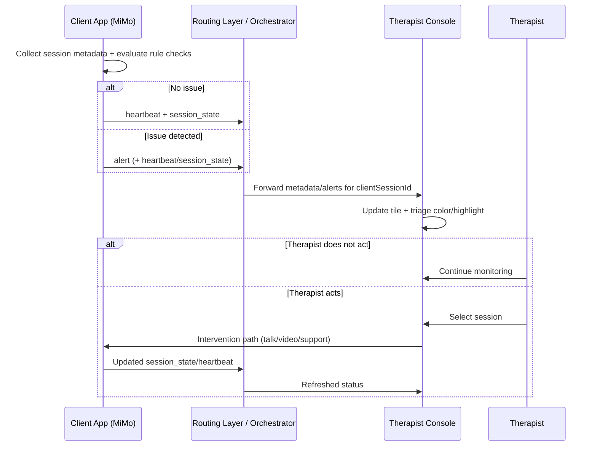

# MiMo Alerting System Workflow

Source reference: `mi_mo_remote_therapy_system_project_brief.md` (therapist project brief).

## 1. Client-Side Alerting Flow

1. Session starts on client (audio/video/screen-share context established).
2. Client collects live session metadata continuously:
   - `clientSessionId`
   - `game/module`
   - `heartbeat`
   - `session status`
   - `connectivity`
   - `activity/progress`
3. Client triage checks run (rule-based MVP intent):
   - no user/no motion
   - inactivity timeout
   - expected vs observed mismatch
   - repeated failure/no progress
   - disconnected state
4. Decision branch:
   - No issue: keep sending heartbeat/session-state.
   - Issue detected: create alert object with severity (`green|yellow|red`) + timestamp + context.
5. Client emits events:
   - heartbeat events
   - session-state events
   - alert events
   - optional snapshot/context metadata
6. Events are routed to therapist dashboard (via orchestration/transport path defined by deployment).

## 2. Therapist-Side Alerting Flow

1. Therapist side receives client metadata + alerts.
2. Dashboard updates per session tile:
   - participant/session identifier
   - connection/session state
   - active module/game
   - alert state
3. Alert triage rendering:
   - Green = normal
   - Yellow = warning
   - Red = intervention needed
   - highlight sessions requiring action
4. Therapist decision:
   - No action: continue monitoring
   - Action: select session and intervene
5. Intervention path:
   - focused 1:1 talk/video intervention
   - session focus mode
   - remote support/control flow (where implemented)

## 3. End-to-End Operational Loop

`Client detects -> backend/session route -> therapist monitors -> therapist intervenes -> return to monitoring`

## 4. Sequence Diagram

## 5. Payload Schema Table (MVP)

| Event Type | Required Fields | Optional Fields | Purpose |
|---|---|---|---|
| `heartbeat` | `clientSessionId`, `heartbeatUnixMs` | `gameId` | Liveness + timing signal for session continuity |
| `session_state` | `clientSessionId` | `sessionStatus`, `connectivityState`, `currentModule`, `expectedActivityType`, `activityProgress`, `snapshotRef` | Operational state context for therapist monitoring |
| `alert` | `clientSessionId`, `alerts[]` item with `alertId`, `type`, `severity`, `message`, `timestamp` | `gameId`, `snapshotRef` | Actionable triage signal for therapist intervention |

## 6. Alert Severity & Response Guidance

| Severity | Meaning | Expected Therapist Action |
|---|---|---|
| `green` | normal or low concern | observe only |
| `yellow` | warning / potential deviation | monitor closely, prepare intervention |
| `red` | intervention needed | immediate session selection + intervention |

## 7. Current-State Notes from the Project Brief

The same project brief marks several items as partial/incomplete for current forks:

- client-side rule engine: not fully implemented
- full triage prioritization: not fully implemented
- complete alert-driven therapist UX: partial
- remote control workflow: not fully implemented

So this workflow represents the intended operating model plus current MVP-aligned behavior, with pending items tracked in the brief.
